  

**`Desenvolvimento de Software`**

# Francisco Lima

Me chamo Francisco Lima, sou de Feira de Santana - BA e atuo com desenvolvimento de software.

Gosto de entender como as aplicações funcionam por completo, desde a interface até APIs, regras de negócio, bancos de dados e organização do código.

Tenho experiência prática com desenvolvimento web e venho trabalhando com diferentes tecnologias em projetos pessoais, acadêmicos e profissionais.

Atualmente continuo aprofundando meus conhecimentos em Engenharia de Software, explorando diferentes áreas do desenvolvimento e construindo projetos para colocar em prática o que aprendo.

  

  

  

  

---

### Linguagens e Tecnologias

 
 

---

### Estatísticas

  
  &nbsp;&nbsp;
  

 

  <picture>
    <source
      media="(prefers-color-scheme: dark)"
      srcset="https://raw.githubusercontent.com/franciscolimatech/franciscolimatech/output/github-contribution-grid-snake-dark.svg"
    />
    <source
      media="(prefers-color-scheme: light)"
      srcset="https://raw.githubusercontent.com/franciscolimatech/franciscolimatech/output/github-contribution-grid-snake.svg"
    />
    
  </picture>

